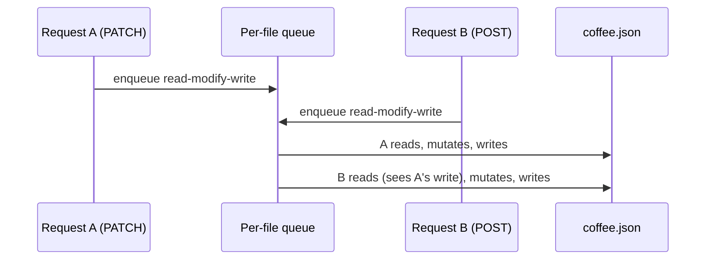

[Wiki Home](../README.md) › [API Surface](./README.md)

# CRUD & Validation

Every collection supports full CRUD, and mutations **persist to the JSON file on disk** until the next [data reset](../data/data-reset.md).

## Methods

| Method                  | Behavior                                                                                        |
| ----------------------- | ----------------------------------------------------------------------------------------------- |
| `POST /:resource`       | Appends the body; assigns `max(id) + 1` when no `id` is sent; returns `201` + `Location` header |
| `PUT /:resource/:id`    | Full replace — body becomes the record (original `id` is kept)                                  |
| `PATCH /:resource/:id`  | Shallow merge of body into the record                                                           |
| `DELETE /:resource/:id` | Removes the record; returns `{}`                                                                |

## Shape validation

Before the router runs, the `verifyData` middleware compares the request body against the **first record** of the target collection — the first record acts as the de facto schema:

- **POST / PUT** — body must contain every key the first record has (`id` is exempt); otherwise `400` with the expected shape echoed back
- **PATCH** — body must contain at least one key that exists on the record
- **GET / DELETE** — skipped (no body to validate)

This keeps student-submitted data consistent with each collection without maintaining schema files.

## Concurrency

Read-modify-write cycles are serialized through a per-file promise queue, so concurrent mutations can't lose updates and a read never observes a half-applied write.

## Key files

- [server/utils/jsonRouter.js](../../server/utils/jsonRouter.js) — CRUD handlers and the lock
- [server/utils/verifyData.js](../../server/utils/verifyData.js) — shape validation

## Related

- [REST Conventions](./rest-conventions.md)
- [Error Responses](./error-responses.md)
- [Data Reset](../data/data-reset.md)
