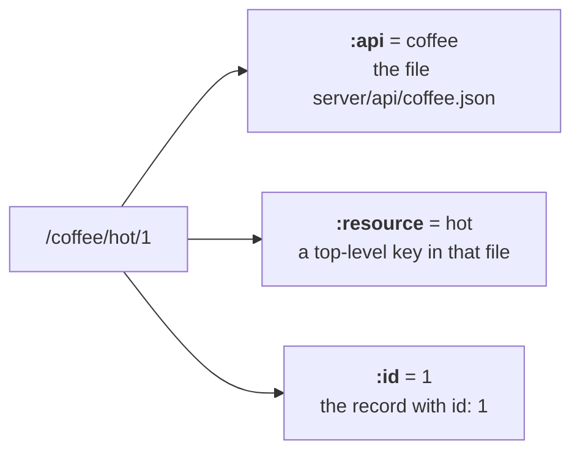

[Wiki Home](../README.md) › [API Surface](./README.md)

# REST Conventions

The URL shape for all data endpoints is:

```
https://api.sampleapis.com/:api/:resource[/:id]
```



Each API is one [JSON file](../data/endpoint-json-format.md); the [registry](../data/api-registry.md) decides which files get mounted.

## Collections vs. singular resources

The type of the top-level value decides the behavior:

- **Array** → a collection: `GET /:resource`, `GET /:resource/:id`, and full [CRUD](./crud-and-validation.md)
- **Object** → a singular resource: `GET /:resource` returns it as-is; no `:id` routes

Collection `GET` responses include an `X-Total-Count` header with the match count before [pagination](./sorting-and-pagination.md).

## Compatibility

Response shapes deliberately mirror **json-server 0.17** so tutorials written against json-server keep working — see [Why a Custom JSON Router](../decisions/why-custom-json-router.md).

## Key files

- [server/utils/jsonRouter.js](../../server/utils/jsonRouter.js) — the router factory
- [server/routes/base-apis.js](../../server/routes/base-apis.js) — mounts one router per API

## Related

- [Querying & Filtering](./querying-and-filtering.md)
- [Sorting & Pagination](./sorting-and-pagination.md)
- [CRUD & Validation](./crud-and-validation.md)
- [Endpoint JSON Format](../data/endpoint-json-format.md)
