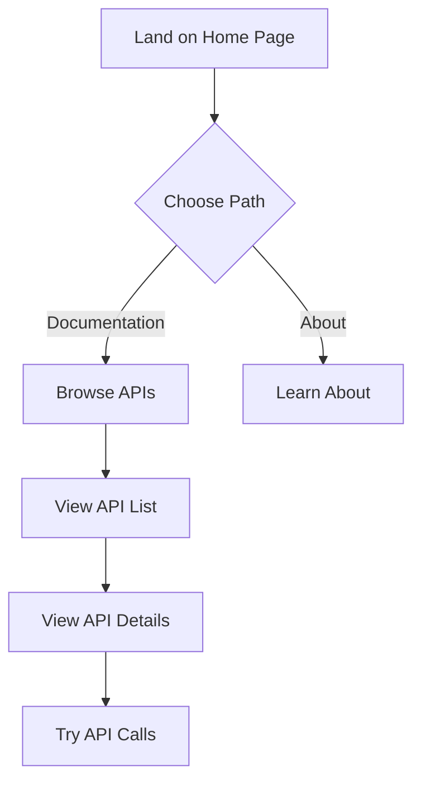
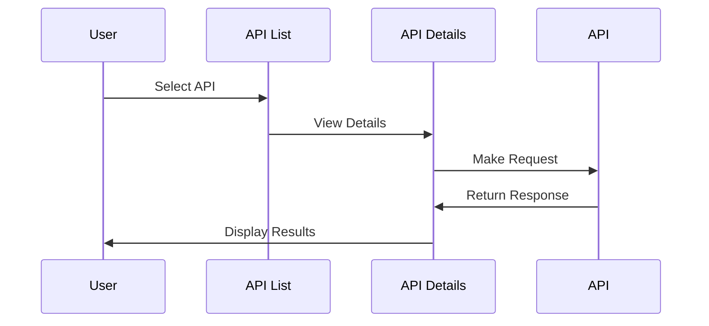
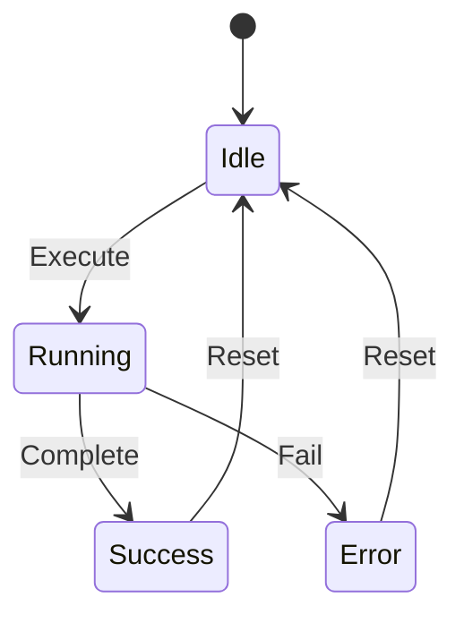
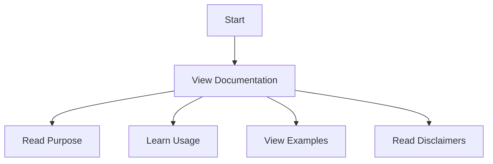
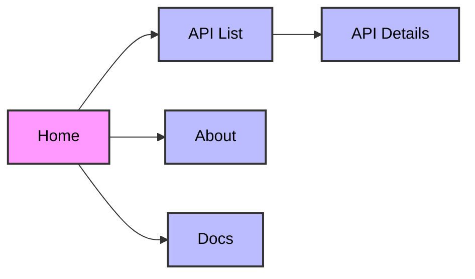

# SampleAPIs Application Flow Documentation

## Overview

This document outlines the various user journeys and application flows within the SampleAPIs platform. It provides a comprehensive view of how users interact with the system and the different paths they can take.

## User Journeys

### 1. First-Time Visitor Journey



1. **Landing Page**

   - User arrives at the home page
   - Views platform overview
   - Can access documentation or about page

2. **Documentation Exploration**
   - Browse available APIs
   - View API details
   - Try API calls

### 2. API Testing Journey



1. **API Selection**

   - Choose specific API
   - View endpoint documentation
   - Understand request parameters

2. **Request Building**

   - Configure request parameters
   - Choose HTTP method

3. **Response Analysis**
   - View response data
   - Check status codes

### 3. Code Playground Journey



1. **Code Execution**

   - Write API integration code
   - Run code in playground
   - View console output

2. **Error Handling**
   - View syntax errors in editor
   - See runtime errors in console
   - Handle network errors

### 4. Documentation Reference Journey



1. **Documentation Overview**

   - View platform purpose
   - Learn about RESTful APIs
   - Understand authentication-free approach

2. **Usage Guide**

   - Learn how to use endpoints
   - View example API calls
   - Understand CRUD operations
   - Learn about data reset policy

3. **Examples**

   - View code snippets
   - Learn fetch examples
   - Understand query parameters
   - Access video tutorial

4. **Important Information**
   - Educational purpose notice
   - Data reset policy
   - Terms of service
   - Contribution guidelines

## Navigation Flows

### 1. Main Navigation



- Home → API List
- Home → About
- Home → Docs
- API List → API Details

## Error Handling Flows

### 1. API Errors

The API uses a combination of middleware and validation for error handling:

1. **Request Validation**

   - Validates request body against expected data structure
   - Checks for required fields in POST/PUT requests
   - Validates field types and formats
   - Returns 400 error with expected vs received data

2. **Rate Limiting**

   - Limits requests to 5000 per 15 minutes
   - Returns 429 error when limit exceeded
   - Whitelist for specific IPs

3. **Response Format**

   ```json
   {
     "error": 400,
     "message": "Error description",
     "expected": { "field": "type" },
     "received": { "field": "value" }
   }
   ```

4. **Common Error Codes**
   - 400: Bad Request (Invalid data)
   - 404: Not Found
   - 429: Too Many Requests
   - 500: Server Error

### 2. Playground Errors

The playground uses Sandpack (CodeSandbox's React component) for code execution. Error handling is managed by Sandpack itself:

1. **Code Execution**

   - Syntax errors are shown in the editor
   - Runtime errors are displayed in the console
   - Network errors are handled in the try/catch block
   - Response errors are shown in the UI

2. **Error Display**
   - Errors are shown in the Sandpack console
   - Network errors are displayed in the UI
   - Syntax errors are highlighted in the editor
   - Runtime errors are logged to the console

## State Management

### Frontend State Management

The frontend uses React Context for global state management through `GlobalContext`:

```typescript
interface iGlobal {
  navVisible: boolean;
  setNavVisible: Dispatch<boolean>;
  apiList: APIData[];
  setAPIList: Dispatch<APIData[]>;
  appState: AppStateEnum;
  setAppState: Dispatch<AppStateEnum>;
  isLoggedIn: boolean;
  setIsLoggedIn: Dispatch<boolean>;
  apiCategories: string[];
  setApiCategories: Dispatch<string[]>;
}
```

Key state features:

- Navigation visibility state
- API list and categories
- Application state (initial, loading, ready, error)
- Authentication state

### Backend State Management

The backend is stateless and uses:

- JSON files for data storage
- Express middleware for request handling
- Rate limiting for API protection
- Data validation middleware

Key features:

- No session state
- File-based data storage
- Request validation
- Rate limiting
- Error handling middleware
