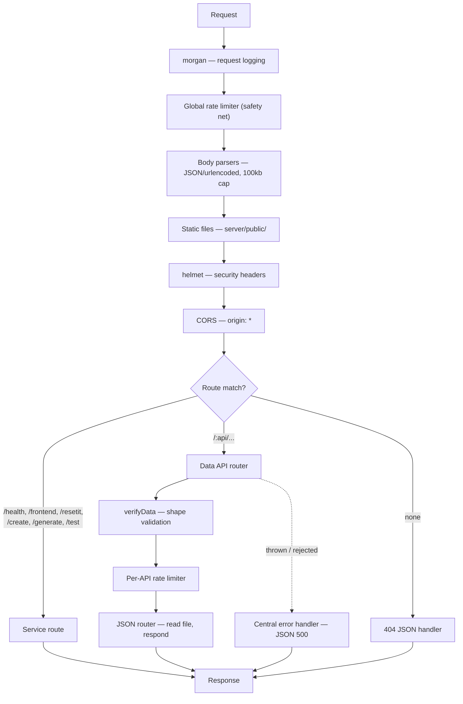

[Wiki Home](../README.md) › [Architecture](./README.md)

# Request Lifecycle

Every request to the server passes through the middleware stack defined in [server/sampleapis.js](../../server/sampleapis.js):

Notes worth knowing:

- `trust proxy` is set to `1` so rate limiting keys on the real client IP behind Docker/nginx rather than the proxy address.
- Body parsers cap payloads at `100kb` so oversized requests can't exhaust memory.
- The data router reads its JSON file **fresh from disk on every request**, which is what lets a [data reset](../data/data-reset.md) take effect without a restart.

## Related

- [REST Conventions](../api/rest-conventions.md)
- [Error Responses](../api/error-responses.md)
- [Service Routes](../api/service-routes.md)
- [Rate Limiting](../api/rate-limiting.md)
