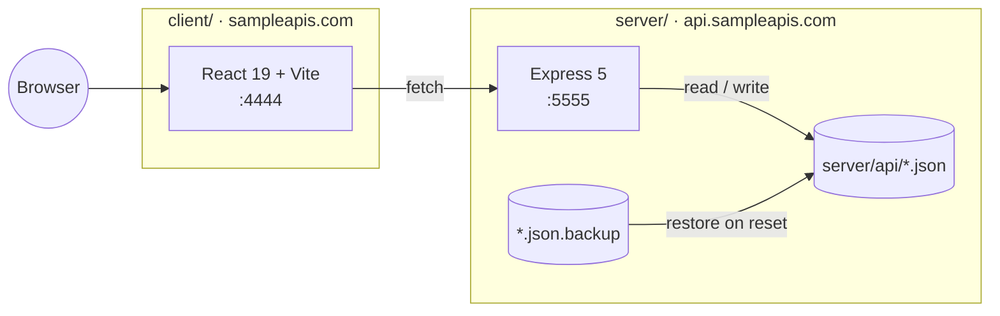

[Wiki Home](../README.md) › [Architecture](./README.md)

# System Overview

SampleAPIs is a free, no-authentication playground of RESTful sample APIs for people learning to work with APIs. One repository, two deployable apps, zero databases.

## The two apps

- **Server** — an Express 5 app that serves every JSON file in `server/api/` as a full-CRUD REST API. See [REST Conventions](../api/rest-conventions.md) for the API surface.
- **Client** — a React site that lists the available APIs, shows details for each, and embeds a code [Playground](../features/playground.md) for trying requests in the browser.

## The datastore is the filesystem

Each API is one JSON file, read fresh on every request. Mutations are written back to the same file, and every file has a `.json.backup` twin used to [reset the data](../data/data-reset.md). This is a deliberate choice — see [Why Flat JSON Files](../decisions/why-flat-json-files.md).

## Defining traits

- **No auth** — anyone can read and write; that is the point of the service.
- **Rate limited** — abuse is contained by [two request limiters](../api/rate-limiting.md).
- **Self-healing** — data is periodically restored from the backup twins.
- A legacy Pug-rendered site still ships inside the server at `/` (see [Service Routes](../api/service-routes.md)).

## Key files

- [server/sampleapis.js](../../server/sampleapis.js) — server entry point
- [client/src/main.tsx](../../client/src/main.tsx) — client entry point

## Related

- [Project Structure](./project-structure.md)
- [Tech Stack](./tech-stack.md)
- [Request Lifecycle](./request-lifecycle.md)
