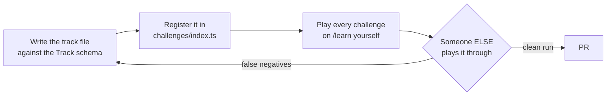

[Wiki Home](../README.md) › [Contributing](./README.md)

# Authoring a Track

A track is a **data file**, not code — one TypeScript module in [client/src/challenges](../../client/src/challenges/) exporting a `Track`, registered in [index.ts](../../client/src/challenges/index.ts). Contributing one is like [contributing a dataset](../data/adding-an-endpoint.md): write the file against the schema, play it through, open a PR. No Playground internals required.



## The schema

Everything lives in [types.ts](../../client/src/challenges/types.ts); the compiler enforces it. A minimal challenge:

```ts
{
  id: "handle-404",                    // stable, kebab-case, used in progress storage
  title: "Handle the 404",
  prompt: "Request a character that doesn't exist and log a friendly message.",
  note: "fetch() does NOT throw on a 404 — you have to check the status yourself.",
  starter: (url) => `const resp = await fetch("${url}/9999");\n\n`,
  checks: [ /* see catalog below */ ],
  hints: [
    "resp.ok is true only for 2xx statuses.",
    "if (!resp.ok) { console.log(...) } else { ... }",
  ],
  solution: (url) => `const resp = await fetch("${url}/9999");\n...`,
}
```

`starter` and `solution` are functions of the endpoint URL so tracks work in dev (localhost) and production unchanged. The track's `apiLink` + `endpoint` name which API it runs against; a banner appears automatically on that API's details page.

## The check catalog

The full vocabulary and its semantics: [Challenge Checks](../features/challenge-checks.md). Rules of thumb:

- **Prefer network checks over console checks.** `responseStatus` can't be faked by a learner logging the right string; `consoleIncludes` should only assert on things the data guarantees (a seeded character's name, not a count that writes can change).
- **Never depend on other learners' writes.** Assert "a POST got a 201" or "your record appears in a subsequent GET" — never "the list has exactly N items". Datasets are shared and [reset on a schedule](../data/data-reset.md).
- **A check that rejects a correct-but-different solution is worse than no check.** If a learner can reasonably solve it another way, loosen the spec (drop `urlIncludes`, lower `consoleCount`) or split the challenge.
- Missing a check kind you genuinely need? That's a deliberate extension point — see decision [D1](../future-features/plans/guided-challenges-decisions.md#d1--check-expressiveness): new kinds (or named predicates) go in reviewed core code, never in track files.

## Voice

- **`prompt`** — one imperative sentence; say *what*, let hints cover *how*.
- **`failMessage`** — guidance, not judgment: name what was expected and the most likely fix ("check the query-string spelling"), because it's shown at the exact moment of frustration.
- **`hints`** — order them from nudge to near-answer; the learner pays one click per hint and the solution unlocks only after all of them ([D4](../future-features/plans/guided-challenges-decisions.md#d4--hint-and-solution-policy)).
- **`solution`** — worded by the UI as "one way to do it"; write idiomatic code you'd want copied.

## The playtest gate

Before the PR: someone who didn't write the track finishes it without your help, and every "the check failed but my code was right" report gets fixed. This is the phase gate, not a nicety — weak validation frustrates more than it teaches. Then: `npm test`, `npm run lint`, and `npx tsc` in `client/` all pass.

## Key files

- [client/src/challenges/types.ts](../../client/src/challenges/types.ts) — the schema
- [client/src/challenges/rest-basics.ts](../../client/src/challenges/rest-basics.ts) — the reference track to crib from
- [client/src/challenges/index.ts](../../client/src/challenges/index.ts) — the registry

## Related

- [Challenge Checks](../features/challenge-checks.md) — check semantics and timing
- [Guided Challenges](../features/guided-challenges.md) — the feature overview
- [Adding an Endpoint](../data/adding-an-endpoint.md) — the contribution model this mirrors
