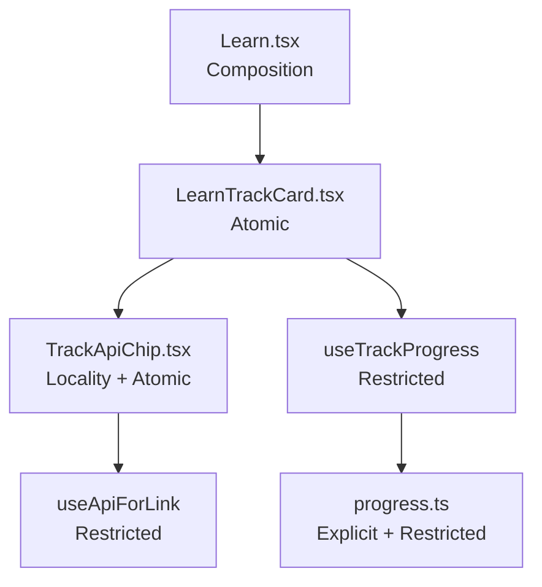

[Wiki Home](../README.md) › [Contributing](./README.md)

# CLEAR Principles

**CLEAR** is how we structure modules so code reads top-down and each unit has one job. The principles are stack-agnostic; this page states them in the abstract and shows how the client expresses them.

*Write CLEAR code — compose at the top, own your locality, name your decisions.*

## Composition

Entry points **orchestrate**; they do not implement. A page, handler, or main function wires smaller units together and should read like an outline. If you have to scroll to understand what a file *does*, the implementation probably belongs one level down.

## Locality

A module **owns what it needs** — fetch, derive, and decide inside the boundary that uses the result. Callers pass **identity** (a domain noun: `track`, `order`, `userId`), not **projections** (pre-digested fields the parent looked up on the child's behalf). Colocate behavior with the code that needs it unless sharing truly forces it up.

## Explicit

Every branch gets a **name** — a function, type, or sub-module. Unnamed conditionals do not belong in the surface layer (markup, handler bodies, template strings). If a decision has a name, a reader can find it, test it, and change it without parsing presentation code.

## Atomic

**One job per unit; one reason to change.** One component per file. When a file makes you think "there's a lot going on here," split by responsibility — not by line count.

## Restricted

Keep the **public surface small**. Pure domain rules and awkward mechanics (I/O, storage, cache, framework glue) stay inside or below the unit that needs them. Callers see intent (`reset`, `getCtaLabel`); they do not see mechanism (`setRefresh`, raw `localStorage` reads).

## How the client expresses CLEAR

| Layer | Role | Example |
| --- | --- | --- |
| `pages/` | Composition — layout and wiring | [Learn.tsx](../../client/src/pages/Learn/Learn.tsx) maps tracks to cards |
| `pages/…/` | Atomic UI pieces | [LearnTrackCard.tsx](../../client/src/pages/Learn/LearnTrackCard.tsx), [TrackApiChip.tsx](../../client/src/pages/Learn/TrackApiChip.tsx) |
| `hooks/` | Restricted bridges to external state | [useTrackProgress.ts](../../client/src/hooks/useTrackProgress.ts), `useApiForLink` in [useApiList.ts](../../client/src/hooks/useApiList.ts) |
| `challenges/`, `utils/` | Explicit + Restricted — pure domain | [progress.ts](../../client/src/challenges/progress.ts) (`getTrackStats`, `getCtaLabel`, …) |

The `/learn` track index is the reference implementation. Before refactor, `Learn.tsx` mixed layout, progress math, API lookup, inline ternaries, and a manual re-render tick; after, each concern has a home.

## Review checklist

- [ ] Does the entry file read like an outline (**Composition**)?
- [ ] Does each file have one reason to change (**Atomic**)?
- [ ] Are callers passing identity, not projections (**Locality**)?
- [ ] Are branches named outside the surface layer (**Explicit**)?
- [ ] Is I/O and domain logic hidden behind a small API (**Restricted**)?

## Related

- [Code Style](./code-style.md) — repo-specific conventions
- [Guided Challenges](../features/guided-challenges.md) — feature that follows CLEAR on `/learn`
- [Data Fetching & State](../features/data-fetching-and-state.md) — TanStack Query as the Restricted bridge for server data
