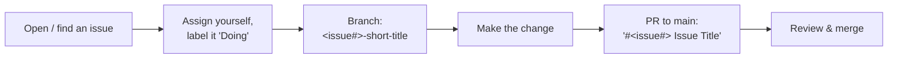

[Wiki Home](../README.md) › [Contributing](./README.md)

# Pull Request Flow

The project is issue-first: discuss before you build.

## Conventions

- **Branch name**: issue number + title, e.g. `12-add-tea-endpoint`
- **PR title**: issue number + issue title, e.g. `#12 Add Tea Endpoint`
- **PR body**: first line links the issue; then a brief summary addressing the issue's acceptance criteria
- Data PRs should include the endpoint documentation described in [CONTRIBUTING.md](../../CONTRIBUTING.md) (overview, example request/response, operations)
- Keeping the branch conflict-free and non-breaking is the contributor's responsibility

The [Code of Conduct](../../CODE_OF_CONDUCT.md) applies everywhere. For what reviewers look at in data contributions, see [Adding an Endpoint](../data/adding-an-endpoint.md).

## Related

- [Getting Started](./getting-started.md)
- [Adding an Endpoint](../data/adding-an-endpoint.md)
