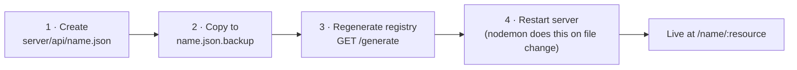

[Wiki Home](../README.md) › [Endpoint Data](./README.md)

# Adding an Endpoint

A new API is three files plus a registry rebuild. This is the most common contribution — see the [pull request flow](../contributing/pull-request-flow.md) for process.

## Steps

1. **Create `server/api/<name>.json`** following the [endpoint JSON format](./endpoint-json-format.md) — a `metaData` entry plus one array per resource, each record with a unique `id`.
2. **Copy it to `server/api/<name>.json.backup`** — the pristine twin that [resets](./data-reset.md) restore from.
3. **Regenerate the [API registry](./api-registry.md)** by hitting `GET /generate` on a running server. This rewrites `server/GeneratedAPIList.js`, which is checked in — commit it with your data files.
4. The router mounts APIs from the registry **at startup**, so the server needs a restart to pick the new API up; locally `nodemon` restarts automatically when the file changes.

## Verify

- `GET http://localhost:5555/<name>/<resource>` returns your data
- Your API appears on the site's API list (it reads [`/frontend`](../api/service-routes.md))
- `GET /test` shows your endpoints passing (see [Testing](../operations/testing.md))

## Related

- [Endpoint JSON Format](./endpoint-json-format.md)
- [API Registry](./api-registry.md)
- [Pull Request Flow](../contributing/pull-request-flow.md)
