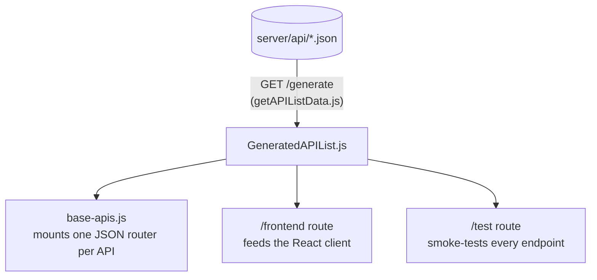

[Wiki Home](../README.md) › [Endpoint Data](./README.md)

# API Registry

`server/GeneratedAPIList.js` is a **generated, checked-in module** cataloging every API: its name, link, `metaData`, and resource list (with `metaData` filtered out). It is the single source three consumers share:

## How it regenerates

Hitting [`GET /generate`](../api/service-routes.md) scans `server/api/` (skipping `.backup` files), reads each file's `metaData`, and rewrites `GeneratedAPIList.js`. Because routing reads the registry **at require time**, a server restart is needed after regeneration — part of [adding an endpoint](./adding-an-endpoint.md).

## Why generated-and-checked-in

The registry could be built on boot, but generating it once and committing it keeps startup instant, makes the API list diffable in PRs, and lets the [tests](../operations/testing.md) assert against a stable artifact.

## The deprecated sibling

`server/apiList.js` is an older, hand-maintained list that only feeds the legacy Pug site at `/`. It is deprecated and will be removed with that site.

## Key files

- [server/GeneratedAPIList.js](../../server/GeneratedAPIList.js) — the artifact
- [server/utils/getAPIListData.js](../../server/utils/getAPIListData.js) — the generator
- [server/routes/base-apis.js](../../server/routes/base-apis.js) — the main consumer

## Related

- [Adding an Endpoint](./adding-an-endpoint.md)
- [Service Routes](../api/service-routes.md)
