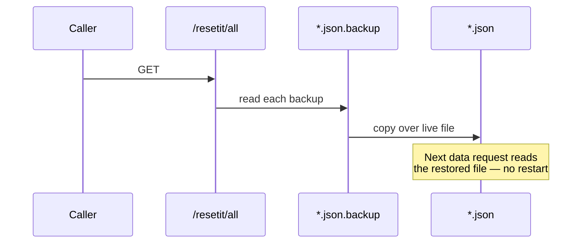

[Wiki Home](../README.md) › [Endpoint Data](./README.md)

# Data Reset

Writes to the API [persist to disk](../api/crud-and-validation.md), so the data drifts as people experiment. Every API file has a pristine `.json.backup` twin, and the reset routes restore from it:

- `GET /resetit/all` — restore **every** API
- `GET /resetit/:api` — restore one API (JSON 404 if the name is unknown)

The restore is a straight file copy. Because the [JSON router](../api/rest-conventions.md) reads its file fresh from disk on every request, the reset takes effect immediately — no server restart.

In production the data is reset on a regular cadence (weekly, per the site's disclaimer), and also whenever a new endpoint ships. Want a change to survive resets? [Contribute it to the repo](../contributing/pull-request-flow.md) so it lands in the backup itself — that is the loop that keeps datasets community-maintained. The reasoning behind this design lives in [Why Persistent Writes + Resets](../decisions/why-weekly-resets.md).

## Key files

- [server/routes/reset.js](../../server/routes/reset.js)

## Related

- [CRUD & Validation](../api/crud-and-validation.md)
- [Why Persistent Writes + Resets](../decisions/why-weekly-resets.md)
- [Service Routes](../api/service-routes.md)
