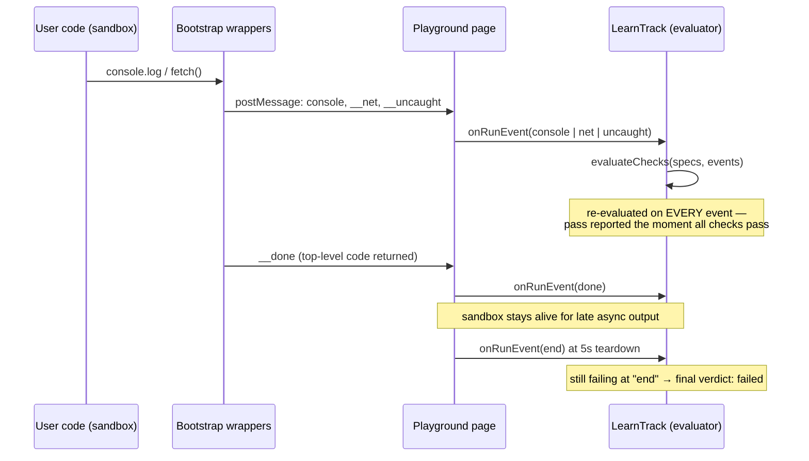

[Wiki Home](../README.md) › [Client Features](./README.md)

# Challenge Checks

A challenge is graded by evaluating **declarative check specs** against the **event stream** a Playground run emits. The two important properties: checks run **on the page, not in the sandbox** (user code can never reach the checker, and the spec never enters the iframe), and the evaluator is a **pure function** over an event array (re-runnable at any moment, unit-testable without a browser).

## The event stream

The sandbox [bootstrap](../glossary.md#client-and-playground) already wraps `console.*`; challenge grading adds two more signals over the same [tokened postMessage channel](../glossary.md#client-and-playground):

- `__net` — every `fetch()` call, reported by the [HTTP Inspector](./http-inspector.md)'s wrapper as `request` / `response` / `error` phases with method, URL, and status.
- `__uncaught` — a marker sent alongside the error output whenever an error escapes user code (top-level throw, `window.onerror`, unhandled rejection). It lets checks distinguish "the run crashed" from a deliberate `console.error(...)`.

[LearnTrack.tsx](../../client/src/pages/Learn/LearnTrack.tsx) normalizes these into the evaluator's shape (`SandboxEvent`): console lines become text (objects are JSON-stringified, so `consoleIncludes` can match inside logged objects), net events become `request`/`response` records.

## The check vocabulary

Checks are a tagged union ([types.ts](../../client/src/challenges/types.ts)) — a fixed vocabulary, grown deliberately (decision [D1](../future-features/plans/guided-challenges-decisions.md#d1--check-expressiveness)):

| Kind | Passes when | Options |
| --- | --- | --- |
| `requestMade` | ≥ `minCount` requests matched | `method?`, `urlIncludes?`, `minCount?` |
| `responseStatus` | some matching response had this status | `status`, `method?`, `urlIncludes?` |
| `consoleIncludes` | some console line contains the pattern (case-insensitive) | `pattern` |
| `consoleCount` | at least `min` lines were logged | `min` |
| `noUncaughtError` | no `__uncaught` marker was seen | — |

Every check also carries a `label` (shown next to the ✓/✗) and a `failMessage` — the teaching voice lives in the content, not in the harness.

## Timing rules

`__done` means top-level code returned, **not** that async work settled — an un-awaited `.then()` chain keeps emitting until the 5-second [run timeout](../glossary.md#client-and-playground). So the evaluator re-runs on every incoming event:

- **All checks pass** → success is reported immediately (progress saved, sandbox left to wind down on its own).
- **Still failing at `end`** (timeout teardown or a new run starting) → the final verdict is "failed" and each unmet check shows its `failMessage`.
- A run with zero events and an instant `__done` gets the same treatment — checks simply fail with their messages.

Because the evaluator is pure, order never matters: the vitest suite ([evaluate.test.ts](../../client/src/challenges/evaluate.test.ts)) covers pass, fail, late-async reordering, filters, and the zero-event run. Run it with `npm test` in `client/`.

## Key files

- [client/src/challenges/evaluate.ts](../../client/src/challenges/evaluate.ts) — `evaluateChecks()` / `allPass()`
- [client/src/challenges/types.ts](../../client/src/challenges/types.ts) — `CheckSpec`, `SandboxEvent`
- [client/src/pages/Learn/LearnTrack.tsx](../../client/src/pages/Learn/LearnTrack.tsx) — event normalization and timing
- [client/src/components/Playground/Playground.tsx](../../client/src/components/Playground/Playground.tsx) — `onRunEvent` emission, `__uncaught` markers

## Related

- [Guided Challenges](./guided-challenges.md) — the feature this powers
- [HTTP Inspector](./http-inspector.md) — the fetch wrapper the network checks feed on
- [Authoring a Track](../contributing/authoring-a-track.md) — using the vocabulary well
