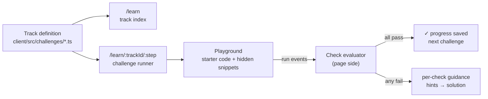

[Wiki Home](../README.md) › [Client Features](./README.md)

# Guided Challenges

`/learn` turns the [Playground](./playground.md) into a course. A **track** is an ordered set of **challenges**; each challenge gives the learner a prompt, starter code, and a set of **checks** that grade the run automatically. Everything is client-side: no accounts, no server state, progress in `localStorage`.

## The three layers

1. **Definitions are data.** Each track is a TypeScript module in [client/src/challenges](../../client/src/challenges/) exporting a `Track` against a compiler-enforced schema — see [Authoring a Track](../contributing/authoring-a-track.md). The only live track is [rest-basics.ts](../../client/src/challenges/rest-basics.ts), a concept track (GET → read → filter → 404 → POST → verify) that runs on Futurama.
2. **Validation is page-side.** The runner listens to the run's event stream (console lines, network events) and evaluates declarative checks against it. The sandbox never sees a check spec — see [Challenge Checks](./challenge-checks.md).
3. **The runner is a Playground host.** The challenge page renders the same `Playground` component the API details page uses, passing challenge-mode props: `defaultCode` (the starter), `storageKey` (per-challenge buffer persistence), `hideSnippets`, and `onRunEvent` (the event stream the checks consume).

## Routes and navigation

- `/learn` — track index: title, description, progress ("2 of 6 completed"), Start/Continue (jumps to the first incomplete challenge), and Reset progress.
- `/learn/$trackId/$step` — the runner; `$step` is 1-based, so every challenge is deep-linkable (`/learn/rest-basics/4`). Progress dots double as navigation.
- API details pages advertise their tracks with a banner ("This API has a practice track →") via `tracksForApi()`.

## Hints and solutions

Hints reveal one per click, any time — no failed-attempt gating. The solution button stays disabled until every hint has been revealed, and the solution is captioned "one way to do it" because checks accept any correct approach. (Policy decided in [D4](../future-features/plans/guided-challenges-decisions.md#d4--hint-and-solution-policy).)

## Persistence

| What | `localStorage` key |
| --- | --- |
| Completed challenges per track | `sampleapis:challenges:<trackId>` |
| Editor buffer per challenge | `sampleapis:challenges:code:<trackId>:<challengeId>` |

Write-exercises are safe by design: data heals on the [reset cadence](../data/data-reset.md), and prompts say so.

## Key files

- [client/src/pages/Learn/LearnTrack.tsx](../../client/src/pages/Learn/LearnTrack.tsx) — runner composition
- [client/src/pages/Learn/Learn.tsx](../../client/src/pages/Learn/Learn.tsx) — track index (composition)
- [client/src/pages/Learn/LearnTrackCard.tsx](../../client/src/pages/Learn/LearnTrackCard.tsx) · [TrackApiChip.tsx](../../client/src/pages/Learn/TrackApiChip.tsx) — index UI pieces
- [client/src/hooks/useChallengeRunner.ts](../../client/src/hooks/useChallengeRunner.ts) · [useTrackProgress.ts](../../client/src/hooks/useTrackProgress.ts) — restricted state bridges
- [client/src/challenges/playgroundBridge.ts](../../client/src/challenges/playgroundBridge.ts) · [resolveChallenge.ts](../../client/src/challenges/resolveChallenge.ts) — pure domain helpers
- [client/src/challenges/index.ts](../../client/src/challenges/index.ts) — track registry
- [client/src/challenges/progress.ts](../../client/src/challenges/progress.ts) — localStorage progress and pure stats helpers

## Related

- [CLEAR Principles](../contributing/clear-principles.md) — module design; `/learn` is the reference implementation
- [Challenge Checks](./challenge-checks.md) — how a run gets graded
- [Authoring a Track](../contributing/authoring-a-track.md) — writing new lessons
- [Playground](./playground.md) · [HTTP Inspector](./http-inspector.md)
- [Original proposal](../future-features/guided-challenges.md) and [decision log](../future-features/plans/guided-challenges-decisions.md)
