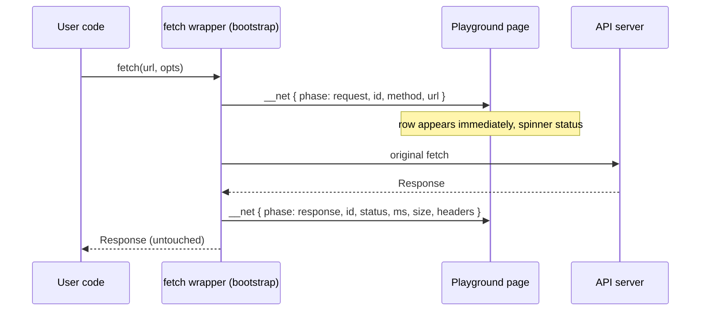

[Wiki Home](../README.md) › [Client Features](./README.md)

# HTTP Inspector

The Playground's output pane has two tabs, **Output** and **Network**, mirroring browser DevTools so the habit transfers. The Network tab shows every request the run's code made with `fetch()` — method, path, color-coded status chip, duration, size — without the learner writing any logging code.

## The fetch wrapper

The sandbox [bootstrap](../glossary.md#client-and-playground) replaces `window.fetch` before user code runs. Each call gets a sequential id so the response can update its request row. Design guarantees:

- **User code sees the exact Response it would without the inspector.** Size is read from `Content-Length` when present, otherwise from `response.clone()` — the clone is what gets consumed.
- **Failures rethrow.** A network-level failure posts an `error` phase, then rethrows so the user's own `catch` still fires. Never swallowed.
- **Duration is time-to-headers** — the honest number `fetch` itself gives you (when the promise resolves), not time-to-body.
- **Best-effort by design.** Code that reassigns `window.fetch` or uses `XMLHttpRequest` simply doesn't appear. Not defended against.

Events travel as a new `__net` level on the existing [tokened postMessage channel](../glossary.md#client-and-playground); the page routes them into separate state from console output, both reset per run.

## The panel

- **Tabs with an unread badge** — network activity while the Output tab is focused increments a count on the Network tab (decision [D1](../future-features/plans/http-inspector-decisions.md#d1--panel-layout)).
- **Status chips** are color-coded the DevTools way: 2xx green, 3xx blue, 4xx orange, 5xx and network failures red; pending rows render immediately from the `request` phase — itself a small lesson in request lifecycle.
- **Expanded row** shows the full URL, a headers table, and — for the four confusing cases (network error, 404, 429, 5xx) — a plain-language explainer ("This usually means…", decision [D2](../future-features/plans/http-inspector-decisions.md#d2--failure-explainers)).
- **Headers are curated first**: teaching-relevant ones (`Content-Type`, `X-Total-Count`, `Link`, `RateLimit-*`, `Retry-After`) surface on top with a "Show all N headers" expander ([D3](../future-features/plans/http-inspector-decisions.md#d3--header-display)). Rows that hit the active endpoint's origin show just the path; foreign origins stay fully visible.

## The server's half

Browsers only let JS read CORS-exposed response headers, so [sampleapis.js](../../server/sampleapis.js) sets `exposedHeaders` for the same list the panel curates — one source of truth, and a benefit to every external API consumer, inspector or not.

## Key files

- [client/src/components/Playground/Playground.tsx](../../client/src/components/Playground/Playground.tsx) — wrapper, `__net` protocol, panel UI, explainers
- [client/src/components/Playground/Playground.css](../../client/src/components/Playground/Playground.css) — tabs, chips, rows
- [server/sampleapis.js](../../server/sampleapis.js) — CORS `exposedHeaders`

## Related

- [Playground](./playground.md) — the editor and sandbox this lives in
- [Challenge Checks](./challenge-checks.md) — the other consumer of `__net` events
- [Rate Limiting](../api/rate-limiting.md) — the headers worth teaching
- [Original proposal](../future-features/http-inspector.md) and [decision log](../future-features/plans/http-inspector-decisions.md)
