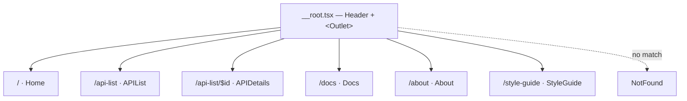

[Wiki Home](../README.md) › [Client Features](./README.md)

# Pages & Routing

The client uses **TanStack Router** with file-based routes: files in `client/src/routes/` define the tree, and the Vite plugin generates `routeTree.gen.ts` (never edit it by hand). Route components delegate to page components in `client/src/pages/`.

## Behaviors worth knowing

- **Auto code-splitting** — the router plugin splits each route into its own chunk; the heavy [Playground](./playground.md) is additionally `lazy()`-loaded inside the [API details page](./api-details-page.md)
- **View transitions** — navigations are wrapped in `document.startViewTransition()` where supported (`defaultViewTransition: true`), with the animations in `styles/transitions.css`
- **Typed routes** — the router instance is registered via module augmentation in `main.tsx`, so `useParams` and `Link` are type-checked

## Key files

- [client/src/routes/__root.tsx](../../client/src/routes/__root.tsx) — layout and 404
- [client/src/main.tsx](../../client/src/main.tsx) — router creation
- [client/vite.config.ts](../../client/vite.config.ts) — router plugin (must run before the React plugin)

## Related

- [API Details Page](./api-details-page.md)
- [Data Fetching & State](./data-fetching-and-state.md)
