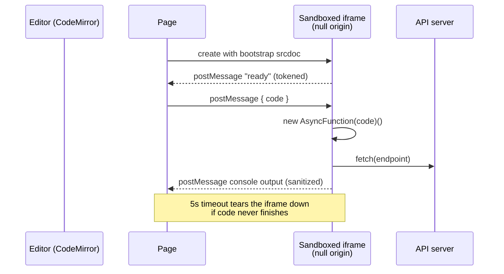

[Wiki Home](../README.md) › [Client Features](./README.md)

# Playground

The Playground is a CodeMirror 6 editor plus a sandboxed runner: visitors edit JavaScript that fetches a real endpoint and see the console output rendered next to the code.

## Editor

- CodeMirror 6 with `basicSetup`, JavaScript language mode, One Dark theme
- Inline syntax errors from the **Lezer parse tree** — no ESLint bundle
- `⌘/Ctrl+Enter` runs; starter **snippets** (async/await, `.then()`, POST) are templated with the current endpoint URL
- The buffer persists to `localStorage` **per endpoint URL**, so switching endpoints never clobbers unsaved edits

## Runner

User code executes inside an iframe with `sandbox="allow-scripts"` and **without** `allow-same-origin` — an opaque origin that can't touch the page's DOM, cookies, or storage. All communication is `postMessage` gated by a per-run random token; console output is sanitized to JSON-safe values before crossing the boundary and rendered with the [JSON tree viewer](./json-tree-viewer.md). The full rationale lives in [Why a Sandboxed Playground](../decisions/why-sandboxed-playground.md).

A run that signals completion keeps the sandbox alive until the 5-second timeout so un-awaited promise output still streams in; a run that never returns is reported as a probable infinite loop and torn down.

## The output pane and hosts

The output pane is tabbed: **Output** (the console, above) and **Network** — the [HTTP Inspector](./http-inspector.md), fed by a fetch wrapper in the same bootstrap. The component is also embeddable as a **challenge host**: optional props supply starter code (`defaultCode`), a custom persistence key (`storageKey`), snippet-tab hiding, and an `onRunEvent` stream of everything the run emits — which is how [Guided Challenges](./guided-challenges.md) grades a run without touching the sandbox.

## Key files

- [client/src/components/Playground/Playground.tsx](../../client/src/components/Playground/Playground.tsx)
- [client/src/components/Playground/snippets.ts](../../client/src/components/Playground/snippets.ts)

## Related

- [Why a Sandboxed Playground](../decisions/why-sandboxed-playground.md)
- [HTTP Inspector](./http-inspector.md) — the Network tab
- [Guided Challenges](./guided-challenges.md) — the challenge host built on this
- [JSON Tree Viewer](./json-tree-viewer.md)
- [API Details Page](./api-details-page.md)
