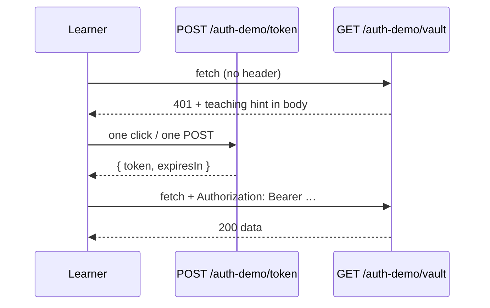

[Wiki Home](../README.md) › [Future Features](./README.md)

# Auth Training Wheels

**Status: proposed.** Medium–high impact, medium–large effort. The most philosophically delicate proposal — it must not erode the "no keys, no sign-up" promise.

## Problem

SampleAPIs' pitch is _no auth_ — that's what makes it frictionless. But authentication is the very next wall every learner hits on a real API: 401s, `Authorization` headers, expired tokens. There is currently nowhere to practice that flow in a consequence-free way; real APIs require signup, and mistakes there have stakes.

## Proposal

One clearly-marked demo API (e.g. `/auth-demo/vault`) that requires a bearer token — with tokens minted by a single click, no account, no email:

Design points:

- **Every failure teaches.** The 401/403 bodies say exactly what's missing or wrong ("No Authorization header — the docs show the format"), following the documented [error shape](../api/error-responses.md).
- **Short-lived tokens** (say 30–60 min) so learners also experience expiry and re-auth — stateless signed tokens (HMAC) mean no server-side storage.
- **Strictly opt-in.** Every regular endpoint stays keyless; this lives on one demo dataset, labeled as a lesson. The default experience is untouched.
- Playground starter snippets and, later, a [Guided Challenges](./guided-challenges.md) track ("get a 401 → mint a token → succeed → let it expire").

## Fit with current code

- Token mint + verification middleware are ordinary Express 5 pieces in the existing [routes layer](../../server/routes); the protected dataset reuses the standard JSON router behind the middleware.
- The sandboxed Playground can set arbitrary headers on `fetch`, so the whole flow is practicable in-browser today.

## Effort & risk

**Medium–large** — mechanically medium (signed tokens, middleware, one dataset, docs), but it needs design care: if the demo ever _feels_ like the site is growing auth requirements, it damages the core promise. Naming, placement, and copy matter as much as code. CORS must expose the `WWW-Authenticate`/hint headers for browser learners.

## Open questions

- Bearer-token only, or also an `?api_key=` variant since both patterns are common in the wild? (Two lessons, one dataset.)
- Does this warrant a [Decision page](../decisions/README.md) up front, given the tension with the site's founding premise?

## Key files

- [server/routes](../../server/routes) — token mint route and auth middleware
- [server/utils/jsonRouter.js](../../server/utils/jsonRouter.js) — reused behind the middleware

## Related

- **Planning:** [Implementation plan](./plans/auth-training-wheels-implementation.md) · [Decision log](./plans/auth-training-wheels-decisions.md)
- [Error Responses](../api/error-responses.md)
- [Guided Challenges](./guided-challenges.md)
- [REST Conventions](../api/rest-conventions.md)
