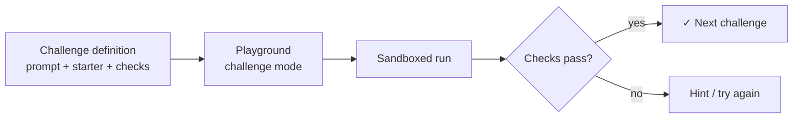

[Wiki Home](../README.md) › [Future Features](./README.md)

# Guided Challenges

**Status: proposed.** The flagship learning feature — very high impact, large effort. Best built after the [HTTP Inspector](./http-inspector.md) and [Query Builder](./query-builder.md), which it composes with.

## Problem

The [Playground](../features/playground.md) is a blank canvas. A learner who doesn't already know what to practice runs the starter snippet, sees JSON, and leaves. Nothing suggests the next step, and nothing confirms they did it right.

## Proposal

Small, ordered exercises attached to APIs, each with a prompt, a starter snippet, and automated validation:

> **Futurama track** — 1. Fetch all characters. 2. Use a query param to get only Bender. 3. POST a new character and confirm it appears in the list. 4. Request a character that doesn't exist and handle the 404.

**Validation** runs inside the existing sandbox: the iframe bootstrap injects a small `expect()`/check harness alongside the console wrapper, runs the challenge's checks after user code settles, and posts a pass/fail result over the tokened `postMessage` channel. Checks range from "response was fetched and is an array of length ≥ N" to "console output contains X" to "a POST to this endpoint occurred" (the latter is free if the [HTTP Inspector](./http-inspector.md)'s fetch wrapper exists).

**Challenge definitions** are data, not code — a JSON/TS module per track with id, prompt, starter snippet, check spec, and hints — so contributing a new track is like contributing a dataset today ([Adding an Endpoint](../data/adding-an-endpoint.md) is the precedent). Progress persists to `localStorage`, consistent with the Playground's existing persistence; no accounts.

## Fit with current code

- The sandbox run/validate/report loop is an extension of the existing tokened messaging in [Playground.tsx](../../client/src/components/Playground/Playground.tsx).
- Starter snippets reuse the templating in [snippets.ts](../../client/src/components/Playground/snippets.ts).
- Writes are safe to require in exercises because data resets on a schedule ([data lifecycle](../data/README.md)).

## Effort & risk

**Large** — the mechanism (check harness, challenge mode UI, progress state) is medium, but content is the real cost: good exercises take authoring and playtesting, and weak validation frustrates more than it teaches (a check that rejects a correct-but-different solution is worse than no check). Start with one polished track on one API before generalizing.

## Open questions

- Check expressiveness: declarative spec (limited but safe/contributable) vs. arbitrary JS checks (powerful but a review burden for contributions)?
- Do challenges live on the API details page or on a dedicated `/learn` route with its own track index?
- Curriculum shape: per-API tracks, or concept tracks (GET → query → POST → errors) that hop across APIs?

## Key files

- [client/src/components/Playground/Playground.tsx](../../client/src/components/Playground/Playground.tsx)
- [client/src/components/Playground/snippets.ts](../../client/src/components/Playground/snippets.ts)

## Related

- **Planning:** [Implementation plan](./plans/guided-challenges-implementation.md) · [Decision log](./plans/guided-challenges-decisions.md)
- [HTTP Inspector](./http-inspector.md) — its fetch wrapper enables request-level checks
- [Shareable Playground Links](./shareable-playground-links.md) — classroom distribution of exercises
- [Error Practice Routes](./error-practice-routes.md) — enables error-handling challenges
