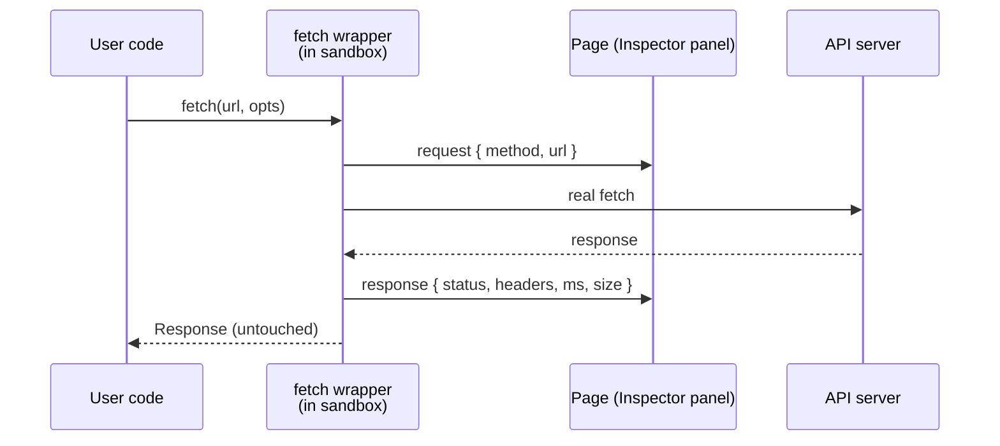

[Wiki Home](../README.md) › [Future Features](./README.md)

# HTTP Inspector

**Status: proposed.** High learning impact, small effort. Recommended first.

## Problem

The [Playground](../features/playground.md) console shows what the user's code logs, but hides the HTTP layer entirely — which is exactly what beginners most need to see. A learner who gets an empty array or a 404 has no way to notice the status code, the final URL, or the response headers unless they think to log `resp.status` themselves.

## Proposal

Wrap `fetch` inside the sandbox iframe's bootstrap script — the same way `console.*` is already wrapped — and stream one event per request back to the page over the existing tokened `postMessage` channel:

Captured per request: method, full URL, status code and text, duration, response `Content-Type` and `Content-Length` (or byte length of the cloned body), and selected response headers worth teaching — the rate-limit headers documented in [Rate Limiting](../api/rate-limiting.md) especially. The wrapper clones the response for measurement and returns the original untouched, so user code behaves identically.

The panel renders as a second tab next to **Output** in the Playground's output pane (the collapse/split layout already exists). Each row expands to show headers, echoing browser DevTools so the skill transfers.

## Fit with current code

- The sandbox bootstrap in [Playground.tsx](../../client/src/components/Playground/Playground.tsx) already sanitizes and streams console events with a per-run token; request/response events are two more message levels on that channel.
- No server changes at all.

## Effort & risk

**Small** — one bootstrap addition, one panel component, some CSS. Risks are minor: the wrapper must not swallow network errors (report them as a failed-request row _and_ rethrow), and header access is limited to CORS-exposed headers, so the server may need an `Access-Control-Expose-Headers` tweak for rate-limit headers to be visible.

## Open questions

- Tabbed panel (Output / Network) or a single interleaved stream with request rows inline between logs?
- Should failed CORS/network requests get a plain-language explainer ("this usually means…")? Cheap and very on-mission.

## Key files

- [client/src/components/Playground/Playground.tsx](../../client/src/components/Playground/Playground.tsx) — bootstrap script and output pane

## Related

- **Planning:** [Implementation plan](./plans/http-inspector-implementation.md) · [Decision log](./plans/http-inspector-decisions.md)
- [Playground](../features/playground.md)
- [Rate Limiting](../api/rate-limiting.md)
- [Error Practice Routes](./error-practice-routes.md) — pairs naturally; the inspector makes deliberate errors visible
