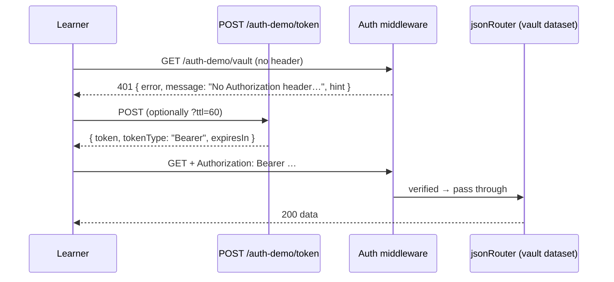

[Wiki Home](../../README.md) › [Future Features](../README.md) › [Plans](./README.md)

# Auth Training Wheels — Implementation Plan

Plan for the [Auth Training Wheels proposal](../auth-training-wheels.md): one clearly-marked demo API requiring a bearer token minted with a single click — no account, no email. The mechanics are ordinary Express middleware; the delicate part is protecting the site's "no keys, no sign-up" promise, which is why this feature's [decision log](./auth-training-wheels-decisions.md) starts with a go/no-go framing decision (D0).

## User stories

1. **Meet the 401.** As a learner, when I fetch the demo API without credentials I get a 401 whose body tells me exactly what's missing and where to get it — the failure _is_ the first lesson.
2. **Mint without friction.** As a learner, I can get a token with one click on the site (or one `POST /auth-demo/token` from code) — no form, no email, nothing stored about me.
3. **Use the header.** As a learner, I add `Authorization: Bearer <token>` to my Playground fetch and the same request now returns 200 — experiencing the exact mechanic every real API will demand.
4. **Experience expiry.** As a learner, I can watch a token expire and see the _expired_ 401 (worded differently from the _missing_ 401), then re-mint — the full lifecycle, compressed into one sitting.
5. **The promise holds.** As any visitor, every other API remains keyless; the demo is visibly labeled a lesson, and nothing about the site suggests auth is creeping in.

## Architecture

### Tokens — stateless, signed, JWT-shaped

- **No server-side storage.** Token = `base64url(header).base64url(payload).base64url(HMAC-SHA256(secret, header.payload))` — the real JWT wire format, built with Node's built-in `crypto`. Zero new dependencies, consistent with the owned-code posture of [Why a Custom JSON Router](../../decisions/why-custom-json-router.md), and what learners see decodes on jwt.io like the tokens they'll meet in the wild. (Hand-rolled vs. `jsonwebtoken` dependency is [D2](./auth-training-wheels-decisions.md#d2--token-implementation).)
- **Payload**: `{ iat, exp }` and nothing else — deliberately no user identity, reinforcing "no accounts".
- **Secret**: `AUTH_DEMO_SECRET` env var with a dev fallback; documented in [deployment](../../operations/deployment.md). Rotating it invalidates outstanding tokens, which is acceptable (and even a realistic lesson).
- **Lifetime**: default per [D3](./auth-training-wheels-decisions.md#d3--token-lifetime); a `?ttl=` mint parameter (floor ~30 s) exists so classrooms can demonstrate expiry in minutes, not by waiting.

### Routes and middleware

- `POST /auth-demo/token` — mints and returns `{ token, tokenType: "Bearer", expiresIn }`. Rate-limited (minting is cheap but shouldn't be a loop target).
- **Auth middleware** guards `/auth-demo/vault/*`, then hands off to the standard [jsonRouter](../../../server/utils/jsonRouter.js) over a new `vault.json` dataset — full CRUD/query behavior behind the header, so everything learners know still works once authenticated.
- **Every failure teaches**, in the documented [error shape](../../api/error-responses.md) plus a `hint`:
  - No header → 401 "No Authorization header — the format is `Authorization: Bearer <token>`; mint one at POST /auth-demo/token."
  - Malformed / bad signature → 401 "That doesn't look like a token from this API…"
  - Expired → 401 "Your token expired at <time> — tokens here live N minutes so you can practice re-authenticating."
  - All 401s carry `WWW-Authenticate: Bearer` (with `error="invalid_token"` where applicable), and CORS must expose it (extends the `exposedHeaders` list from the [HTTP Inspector plan](./http-inspector-implementation.md)).
- Whether an `?api_key=` variant also exists is [D1](./auth-training-wheels-decisions.md#d1--credential-mechanisms).

### The vault dataset

- One small themed dataset (`vault.json` — e.g. "secret lab inventory": the content should make locked-ness feel playful, not corporate). Normal `.json.backup` twin, participates in [data reset](../../data/data-reset.md) like everything else.
- **Registry integration**: the [API registry](../../data/api-registry.md) entry gets a `requiresAuth: true` metadata flag so the client can badge it and the details page can render the mint UI. The registry generator and the `/frontend` payload carry the flag through.
- **Mount order note**: `/auth-demo` mounts as its own router in [sampleapis.js](../../../server/sampleapis.js); the vault dataset must _not_ also be auto-mounted keyless at `/vault` by the base-apis loop — either its file lives outside the auto-registered pattern or the registry flag excludes it from the default mount. This is the one integration subtlety; a test should pin it.

### Client

Scope per [D4](./auth-training-wheels-decisions.md#d4--client-ui-scope); the recommended v1:

- Lock badge on the API card and details page, with one explanatory sentence ("This demo API teaches token auth — every other API stays keyless").
- A **"Mint token"** button on the details page showing the token, a copy button, and a live expiry countdown.
- Playground starter snippets for this API: the three-act flow (fetch → 401, mint, fetch with header → 200) as separate tabs, following [snippets.ts](../../../client/src/components/Playground/snippets.ts). The sandbox sets arbitrary fetch headers already — no Playground changes needed.

## Build phases

| Phase                   | Scope                                                                            | Done when                                                                                     |
| ----------------------- | -------------------------------------------------------------------------------- | --------------------------------------------------------------------------------------------- |
| 1. Token module         | Sign/verify per D2, `ttl` handling, unit tests incl. tampered and expired tokens | Jest: valid/expired/tampered/garbage tokens all classified correctly                          |
| 2. Routes + middleware  | Mint route, middleware, teaching 401 bodies, `WWW-Authenticate`, rate limit      | supertest: full lifecycle incl. every failure body; keyless `/vault` mount does **not** exist |
| 3. Dataset + registry   | `vault.json` + backup, `requiresAuth` registry flag through `/frontend`          | Reset restores it; client receives the flag                                                   |
| 4. Client UI + snippets | Badge, mint button + countdown, starter snippets per D4                          | The 401 → mint → 200 → expiry walkthrough works in the Playground                             |
| 5. Copy & docs          | A `docs/api/` page for the auth demo; wording pass against the D0 guardrails     | Docs reviewed with the promise-protection checklist from D0                                   |

## Testing & verification

- Server: this feature is highly testable — token classification, every 401 variant's body and header, TTL floor/ceiling, mount-order pinning. All Jest + supertest in [server/tests](../../../server/tests).
- Manual: run the full learner journey in the Playground against local, ideally with the [HTTP Inspector](./http-inspector-implementation.md) showing the 401s and `WWW-Authenticate` — the two features compose into the complete lesson.

## Out of scope (v1)

- OAuth flows, refresh tokens, scopes/roles — the lesson is "credential in a header", not identity architecture.
- More than one protected dataset. One vault; the promise stays visibly intact.
- Any persistence of who minted what (there is nothing to persist).

## Key files

- [server/routes](../../../server/routes) — new `auth-demo.js` router
- [server/utils/jsonRouter.js](../../../server/utils/jsonRouter.js) — reused behind the middleware
- [server/sampleapis.js](../../../server/sampleapis.js) — mounting
- [server/utils/getAPIListData.js](../../../server/utils/getAPIListData.js) — registry flag plumbing
- [client/src/components/Playground/snippets.ts](../../../client/src/components/Playground/snippets.ts) — auth starter snippets

## Related

- [Auth Training Wheels — Decisions](./auth-training-wheels-decisions.md) — including the D0 go/no-go
- [Proposal](../auth-training-wheels.md) · [Roadmap](./README.md)
- [Error Responses](../../api/error-responses.md) · [API Registry](../../data/api-registry.md)
- [Guided Challenges plan](./guided-challenges-implementation.md) — a future auth track consumes this
