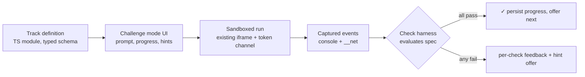

[Wiki Home](../../README.md) › [Future Features](../README.md) › [Plans](./README.md)

# Guided Challenges — Implementation Plan

Plan for the [Guided Challenges proposal](../guided-challenges.md) — the flagship: ordered exercises with prompts, starter code, and automated pass/fail validation running in the existing sandbox. This is the largest client feature in the roadmap and the only one where **content authoring rivals the code in cost**. Open choices live in the [decision log](./guided-challenges-decisions.md).

**Sequencing:** build after the [HTTP Inspector](./http-inspector-implementation.md) — its fetch wrapper provides the request-level events that the most valuable checks ("a POST happened", "you handled the 404") assert on. Building challenges first would mean writing the same wrapper anyway.

## User stories

1. **A path to follow.** As a learner who just ran the starter snippet, I can open a track and get told what to try next ("use a query param to fetch only Bender"), instead of staring at a blank canvas.
2. **Confirmation.** As a learner, when I run my attempt I get explicit pass/fail per check, with failed checks worded as guidance ("expected your code to fetch with `?name.first=…` — check the query-string spelling"), not just red text.
3. **Hints before answers.** As a stuck learner, I can reveal hints one at a time, and only see a full solution after exhausting them (policy per [D4](./guided-challenges-decisions.md#d4--hint-and-solution-policy)).
4. **Progress that survives.** As a returning learner, my completed challenges are remembered in this browser, I can see track progress at a glance, and I can reset it.
5. **Authorable by contributors.** As a contributor, I can add a track by writing a data file against a documented schema and playtesting it — no Playground internals required, same spirit as [contributing a dataset](../../data/adding-an-endpoint.md).
6. **Classroom-ready.** As a teacher, I can link students directly to a specific challenge (via [Shareable Playground Links](./shareable-playground-links-implementation.md) mechanics extended to challenge routes).

## Architecture

Three layers: challenge **definitions** (data), a **check harness** (sandbox), and **challenge mode UI** (client).

### Challenge definitions (data, not code)

TypeScript modules under `client/src/challenges/`, one file per track, exporting against a typed schema roughly:

- **Track**: `id`, `title`, `apiLink` (which API it runs against), `description`, ordered `challenges[]`.
- **Challenge**: `id`, `title`, `prompt` (short markdown), `starter` (template taking the endpoint URL, same shape as [snippets.ts](../../../client/src/components/Playground/snippets.ts)), `checks: CheckSpec[]`, `hints: string[]`, `solution` (code, shown per D4).

TS modules (not JSON) so the schema is compiler-enforced for contributors and templates can be functions — but the _content_ stays declarative. Check expressiveness is the defining decision, [D1](./guided-challenges-decisions.md#d1--check-expressiveness).

A declarative `CheckSpec` (the recommended D1 shape) is a tagged union, e.g.:

| Kind              | Asserts                                                      | Feeds on                       |
| ----------------- | ------------------------------------------------------------ | ------------------------------ |
| `requestMade`     | a request matching `{method, urlPattern, minCount}` occurred | `__net` events (fetch wrapper) |
| `responseStatus`  | a matching request got status N                              | `__net` events                 |
| `consoleIncludes` | some console line matches a pattern/predicate-by-name        | console events                 |
| `consoleCount`    | at least N lines logged                                      | console events                 |
| `noUncaughtError` | run produced no uncaught error/rejection                     | error events                   |

Each check carries its own `failMessage` — the teaching voice lives in the content, not the harness.

### Check harness (sandbox side)

The page already receives every console and (post-Inspector) network event over the tokened channel. **Evaluate checks on the page side, not inside the iframe** — the events are already streaming out, the spec never enters the sandbox, and no user code can reach the checker. This is simpler and safer than the proposal's in-iframe sketch and needs no bootstrap changes at all beyond what the Inspector added.

Timing: user code signalling `__done` doesn't mean async work settled (un-awaited chains keep emitting until the run timeout). So: evaluate on `__done`, then re-evaluate as further events arrive until either all checks pass (report success immediately) or the existing run timeout fires (report the final state). A run with zero events and instant `__done` gets the same treatment — checks just fail with their messages.

### Challenge mode UI

- A track panel wrapping the Playground: prompt card (markdown-lite rendering — keep to bold/code/links, no full markdown dependency), progress dots, Run button shared with the Playground, per-check result list, hint reveal, next/previous.
- Where this lives — API details page vs. a dedicated `/learn` route — is [D2](./guided-challenges-decisions.md#d2--placement-and-routing); curriculum shape (per-API vs. concept tracks) is [D3](./guided-challenges-decisions.md#d3--curriculum-shape).
- Starter-code loading reuses the Playground's snippet-injection path (the same bridge the [Query Builder](./query-builder-implementation.md#send-to-playground) adds — whichever feature lands first builds it).
- **Progress**: `localStorage` key `sampleapis:challenges:<trackId>` holding completed challenge ids + timestamps. No accounts, no server. A "reset progress" affordance per track.

### Writes in exercises

POST/PUT/DELETE challenges are safe and encouraged — data heals on the [reset cadence](../../data/data-reset.md). Prompts should mention it ("your character may vanish when the data resets — that's by design"), turning the reset into a lesson about ephemeral sandboxes. Checks that assert on writes must not depend on _earlier_ learners' writes (e.g. assert "the item you POSTed appears in a subsequent GET", never "the list has exactly 51 items").

## Content plan (the real cost)

- **v1 ships one polished pilot track** (per D3, likely on Futurama): ~6 challenges covering GET → read the response → query filter → handle a 404 → POST → verify your write. Each challenge playtested by someone who didn't write it — a check that rejects a correct-but-different solution is worse than no check, so playtesting is a phase gate, not a nicety.
- An **authoring guide** page under `docs/contributing/` ships with v1: schema reference, check-spec catalog, prompt-writing voice, playtest checklist. Community tracks are the scaling story; the guide is what makes PR review of content tractable.

## Build phases

| Phase                        | Scope                                                                 | Done when                                                                                    |
| ---------------------------- | --------------------------------------------------------------------- | -------------------------------------------------------------------------------------------- |
| 0. Prerequisite              | HTTP Inspector's fetch wrapper + `__net` events merged                | Events observable from a challenge-less run                                                  |
| 1. Schema + harness          | Track/Challenge/CheckSpec types, page-side evaluator, timing rules    | Evaluator unit-tested against synthetic event streams (pass, fail, late-async pass, timeout) |
| 2. Challenge mode UI         | Panel, progress dots, hints, per-check results, localStorage progress | A hardcoded 2-challenge dev track is completable end-to-end                                  |
| 3. Pilot track               | 6 challenges + hints + solutions, playtested and revised              | Two playtesters finish without author intervention; all false-negative reports fixed         |
| 4. Placement + routes        | D2's routing, track index, deep links                                 | Track reachable and shareable per D2                                                         |
| 5. Authoring guide + release | `docs/contributing/` guide, feature doc, proposal marked accepted     | A contributor can draft a track from docs alone                                              |

## Testing & verification

- The check evaluator is a pure function over event arrays — the highest-value unit-test target in the whole roadmap (vitest, per the shared client-testing note in the [Query Builder plan](./query-builder-implementation.md)).
- Content QA is human: the playtest gate in phase 3. Budget real time for it.
- Regression risk to watch: harness changes must not affect normal (non-challenge) Playground runs — a manual smoke of plain runs joins the checklist.

## Out of scope (v1)

- Accounts, server-side progress, completion certificates, leaderboards.
- Arbitrary-JS checks (unless D1 chooses them) and cross-run state ("continue from your last response").
- More than one track — breadth comes from contributors after the authoring guide proves out.
- Authoring UI; tracks are code-reviewed files, exactly like datasets.

## Key files

- [client/src/components/Playground/Playground.tsx](../../../client/src/components/Playground/Playground.tsx) — run loop, messaging, injection point
- [client/src/components/Playground/snippets.ts](../../../client/src/components/Playground/snippets.ts) — starter template shape
- `client/src/challenges/` — track definitions and schema (to be created)
- [client/src/routes](../../../client/src/routes) — if D2 adds a `/learn` route

## Related

- [Guided Challenges — Decisions](./guided-challenges-decisions.md)
- [Proposal](../guided-challenges.md) · [Roadmap](./README.md)
- [HTTP Inspector plan](./http-inspector-implementation.md) — prerequisite fetch wrapper
- [Shareable Playground Links plan](./shareable-playground-links-implementation.md) — distribution
- [Error Practice Routes plan](./error-practice-routes-implementation.md) — future error-handling tracks
- [Data Reset](../../data/data-reset.md) — why write exercises are safe
