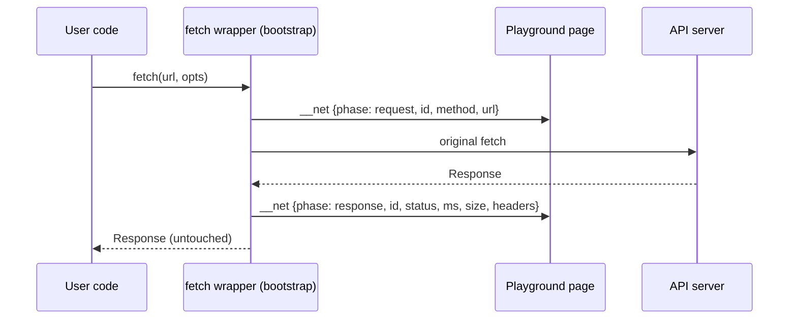

[Wiki Home](../../README.md) › [Future Features](../README.md) › [Plans](./README.md)

# HTTP Inspector — Implementation Plan

Plan for the [HTTP Inspector proposal](../http-inspector.md): wrap `fetch` inside the sandbox iframe and render each request in a mini Network panel beside the Playground console. Open choices live in the [decision log](./http-inspector-decisions.md) — resolve those before building.

## User stories

1. **Empty-result debugging.** As a learner whose fetch returned an empty array, I can see the request's final URL, status code, and duration without writing any logging code — so I notice the typo'd query param instead of blaming the API.
2. **Status-code literacy.** As a learner, every request my code makes shows its method and status (200 / 201 / 404 / 429), color-coded the way browser DevTools does, so the skill transfers to real tools.
3. **Header discovery.** As a learner, I can expand a request row and see teaching-relevant response headers — `X-Total-Count`, the `Link` pagination header, rate-limit headers — that I'd otherwise never know exist.
4. **Failure made visible.** As a learner whose request failed at the network layer (bad host, CORS), I see a failed-request row with a plain-language explanation instead of a bare `TypeError: Failed to fetch`.
5. **Unchanged code behavior.** As a user, my code sees the exact same `Response` object it would without the inspector — nothing consumed, nothing mutated.

## Architecture

Three pieces: a fetch wrapper in the sandbox bootstrap, two new message kinds on the existing tokened `postMessage` channel, and a panel component in the Playground's output pane.

### Fetch wrapper (sandbox bootstrap)

Extends the bootstrap script in [Playground.tsx](../../../client/src/components/Playground/Playground.tsx), alongside the existing console wrapper:

- Replace `window.fetch` before user code runs. Each call gets a **sequential id** so the response row can update its request row.
- On call: post a `request` event — id, method (default `GET`), resolved URL, `performance.now()` start.
- On resolve: post a `response` event — id, status, statusText, elapsed ms, and headers. **Duration is time-to-headers** (when `fetch` resolves), which is the honest number `fetch` itself gives you.
- **Size**: read `Content-Length` if present; otherwise read `response.clone()`'s body and report byte length. The clone is what gets consumed — the original returns to user code untouched.
- On reject: post an `error` event (id, error message), then **rethrow** so user code's `catch` still fires. Never swallow.
- Header capture is limited to CORS-exposed headers by the browser; see the server change below.
- Best-effort by design: if user code reassigns `window.fetch` or uses `XMLHttpRequest`, those requests simply don't appear. Not worth defending against.

### Message protocol

Existing messages are `{ token, level, values }` with levels `log|info|warn|error|debug|__ready|__done`. Add one level, `__net`, whose single value is the event object (`{ id, phase, method, url, status, statusText, ms, size, headers }`). Events are built by the wrapper from primitives, so they need no `sanitize()` pass. The page-side handler routes `__net` into separate state (`netEvents`), everything else into `output` as today. Both reset per run.

### Panel UI

- Lives in the Playground's existing output pane; exact layout (tabs vs. interleaved) is [decision D1](./http-inspector-decisions.md#d1--panel-layout).
- Row: method · path (origin elided when it matches the active endpoint's) · status chip (2xx green, 3xx blue, 4xx orange, 5xx/network red) · duration · size.
- Expanded row: full URL and a headers table. Which headers, and whether an explainer line appears for failures and 429s, are [D2/D3](./http-inspector-decisions.md).
- Pending requests render immediately from the `request` event with a spinner status, then fill in — this is itself a lesson in request lifecycle.

### Server change (one line of config)

Browsers only let JS read CORS-exposed response headers. Add to the `cors()` options in [sampleapis.js](../../../server/sampleapis.js):

`exposedHeaders: ["X-Total-Count", "Link", "Location", "RateLimit-Limit", "RateLimit-Remaining", "RateLimit-Reset", "Retry-After"]`

This also benefits every external consumer of the API, independent of the inspector.

## Build phases

| Phase                 | Scope                                                                   | Done when                                                                                    |
| --------------------- | ----------------------------------------------------------------------- | -------------------------------------------------------------------------------------------- |
| 1. Expose headers     | `exposedHeaders` in the CORS config + server test                       | A Playground fetch can read `X-Total-Count` on a collection GET                              |
| 2. Wrapper + protocol | Bootstrap fetch wrapper, `__net` level, page-side state                 | Events arrive for success, 404, and network-error runs (verify via temporary console output) |
| 3. Network panel      | Panel component, rows, expansion, per-run reset, CSS                    | The user-story walkthroughs above all pass by hand                                           |
| 4. Teaching polish    | Failure explainers (per D2), header curation (per D3), empty-state copy | Copy reviewed; feature doc written in `docs/features/` and the proposal page marked accepted |

## Testing & verification

- **Server** (Jest + supertest in [server/tests](../../../server/tests)): assert the exposed-headers list on a collection response.
- **Client** has no test runner today — verification is a manual checklist: 200 GET, POST 201, GET a missing id (404), fetch a nonexistent host (error row + rethrow reaches user `catch`), a run with zero fetches (empty state), two rapid runs (panel resets), and a response with no `Content-Length` (clone-based size).
- Type-check and lint (`tsc`, `oxlint`) as usual.

## Out of scope (v1)

- Capturing request/response **bodies** (privacy-neutral here, but heavy UI; revisit if [Guided Challenges](../guided-challenges.md) needs it — its checks consume the same events, not the panel).
- `XMLHttpRequest`, WebSocket, or `EventSource` capture.
- Persisting network logs across runs.

## Key files

- [client/src/components/Playground/Playground.tsx](../../../client/src/components/Playground/Playground.tsx) — bootstrap, message handling, output pane
- [server/sampleapis.js](../../../server/sampleapis.js) — CORS config
- [client/src/components/Playground/Playground.css](../../../client/src/components/Playground/Playground.css) — panel styling

## Related

- [HTTP Inspector — Decisions](./http-inspector-decisions.md)
- [Proposal](../http-inspector.md) · [Roadmap](./README.md)
- [Rate Limiting](../../api/rate-limiting.md) — the headers worth teaching
- [Guided Challenges plan](./guided-challenges-implementation.md) — reuses this fetch wrapper for request-level checks
