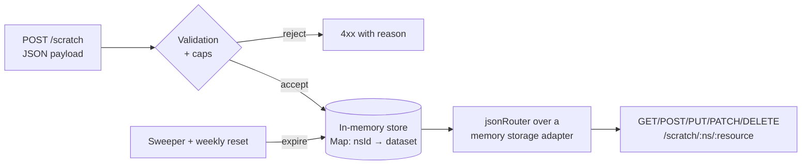

[Wiki Home](../../README.md) › [Future Features](../README.md) › [Plans](./README.md)

# Scratch Endpoints — Implementation Plan

Plan for the [Scratch Endpoints proposal](../scratch-endpoints.md): POST a JSON payload, receive a temporary namespaced endpoint with full jsonRouter behavior. **This plan is contingent** — the [decision log](./scratch-endpoints-decisions.md) opens with a genuine build/defer/reject call (D0), because this is the only proposal whose honest risk assessment includes "don't". Everything below describes _how_ it would be built if D0 says build.

## User stories

1. **My data shape, this afternoon.** As a learner building a todo app, I can POST `{ "todos": [...] }` and get back a base URL that serves full CRUD + querying on _my_ shape for a few hours — without an account, a PR, or leaving the site.
2. **Everything I already learned applies.** As a learner, my scratch endpoint speaks the exact dialect of every other SampleAPIs endpoint — same filters, same pagination headers, same error bodies — so knowledge transfers in both directions.
3. **Honest ephemerality.** As a user whose namespace expired, I get a 410 that says what happened, when it expired, and how to recreate — never a mystery 404.
4. **Early cleanup.** As the creator, I can DELETE my namespace when done (possession of the unguessable URL is the only credential, consistent with the no-accounts posture).
5. **The operator sleeps.** As the maintainer, hard caps bound worst-case memory to a small constant; abuse of the domain (hosting malicious content) is structurally prevented, not just filtered.

## Architecture

### The core refactor: jsonRouter storage adapters

[jsonRouter.js](../../../server/utils/jsonRouter.js) currently reads/writes a file path directly. Extract that pair into a **storage adapter** interface — `{ read(): Promise<db>, write(db): Promise<void> }` — with two implementations:

- **File adapter**: the existing behavior, byte-for-byte (existing tests must pass unchanged — this refactor ships alone, before any scratch code, as its own PR).
- **Memory adapter**: reads/writes an object held in the namespace store. The router's per-instance write-lock queue already serializes mutations; it carries over unchanged.

This is the highest-leverage piece of the feature: 100% behavior parity between scratch and permanent endpoints comes from running literally the same router.

### Namespace lifecycle

- **Create**: `POST /scratch` with `{ "<resource>": [records…], … }`. Response: `201 { base: "/scratch/<id>", expires: <ISO>, resources: [...] }`. The id is 12+ chars from `crypto.randomBytes` (base36) — unguessable, returned once, never listed anywhere.
- **Serve**: `/scratch/:ns/:resource…` → the memory-adapter jsonRouter. `GET /scratch/:ns` returns a small index (resources, record counts, expiry) — self-describing like the practice routes.
- **Expire**: TTL per [D3](./scratch-endpoints-decisions.md#d3--ttl-and-cap-values) (order of hours). A sweeper interval evicts expired namespaces; the weekly [reset](../../data/data-reset.md) clears the store entirely — "nothing here is permanent" now has two enforcement layers.
- **Tombstones**: expired ids go into a bounded FIFO set (id + expiry time only, ~bytes each) so requests after expiry get `410 Gone` with an explanation for ~24 h, then fall through to plain 404. This is the answer to "my endpoint vanished" support noise.
- **Early delete**: `DELETE /scratch/:ns` → 204 and immediate tombstone.

### Validation and caps (structural, not advisory)

Creation is rejected — with a specific, teaching-tone error — unless all of:

- Body is a JSON object whose values are arrays of objects (or plain objects for singular resources), mirroring the [endpoint JSON format](../../data/endpoint-json-format.md); records get ids assigned like the router's `nextId` if missing.
- Within caps (values per D3): payload bytes (the global `express.json` 100 kb limit already backstops this), resources per namespace, records per resource, string-length per field, nesting depth.
- Per-IP active-namespace cap; **global** namespace-count and total-bytes caps — when full, creation returns 503 "scratch capacity is full, try later" rather than degrading anything else.

### Abuse posture (the reason D0 exists)

User-supplied content served from the site's domain is a phishing/malware-hosting primitive if mishandled. Structural defenses, all non-optional if built:

- **JSON-only, always**: every scratch response sets `Content-Type: application/json; charset=utf-8` and `X-Content-Type-Options: nosniff`; nothing user-supplied is ever interpolated into HTML (no Pug rendering anywhere under `/scratch`). A browser visiting a scratch URL sees JSON text, never a page.
- **No discoverability**: no listing, no search, no recent-namespaces — content is only reachable by someone who already has the URL, which caps its value for hosting.
- **Tight rate limits** on creation specifically (distinct from read/write traffic) so the store can't be churned fast.
- **Content scanning is explicitly _not_ relied on** (word filters are trivially evaded); the defense is that JSON-under-100kb-behind-an-unguessable-URL-for-4-hours is a poor hosting product. D4 records this posture for sign-off.

## Build phases

| Phase                          | Scope                                                                                  | Done when                                                                    |
| ------------------------------ | -------------------------------------------------------------------------------------- | ---------------------------------------------------------------------------- |
| 0. D0 gate                     | Build/defer/reject decided; if build, D1–D4 answered                                   | Decision recorded here and in [Decisions](../../decisions/README.md)         |
| 1. Adapter refactor            | Storage-adapter extraction, file adapter, zero behavior change                         | Entire existing server test suite green with no test edits                   |
| 2. Store + lifecycle           | Namespace store, create/index/delete routes, sweeper, tombstones/410                   | supertest: lifecycle end-to-end incl. expiry (short test TTL)                |
| 3. Validation + caps           | All caps per D3, teaching error bodies, creation rate limit                            | supertest: each cap individually rejected with the right body; 503-when-full |
| 4. Router mounting             | Memory adapter + jsonRouter under `/scratch/:ns`, parity checks                        | The querying-docs examples all work against a scratch namespace              |
| 5. Hardening + docs            | nosniff/content-type audit, `docs/api/` page, ops note on memory monitoring            | Abuse checklist (D4) walked and signed off                                   |
| 6. (Optional, later) Client UI | Per [D2](./scratch-endpoints-decisions.md#d2--client-ui-in-v1) — default is none in v1 | —                                                                            |

## Testing & verification

- Phase 1's "no test edits" bar is the critical regression gate for the whole existing API.
- Parity: run the documented query examples against a scratch namespace in CI-style supertest — divergence between scratch and permanent endpoints is a bug by definition.
- Load sanity: script creating namespaces to the global cap, confirm 503 behavior and stable memory (a one-off script in [server/tests](../../../server/tests) or `endpoint-test/`, not CI).

## Out of scope (v1)

- Any persistence (disk spill, export) — memory-only _is_ the product decision (D1).
- Client UI (per D2 default), custom TTLs, namespace renewal/extension ("just recreate it").
- Webhooks, relationships between resources, or anything mockapi.io charges for — the "don't build, recommend mockapi.io" option in D0 exists precisely because that product is deep.

## Key files

- [server/utils/jsonRouter.js](../../../server/utils/jsonRouter.js) — adapter refactor target
- [server/utils/verifyData.js](../../../server/utils/verifyData.js) — precedent for shape validation voice
- [server/routes/reset.js](../../../server/routes/reset.js) — reset hook for store clearing
- [server/sampleapis.js](../../../server/sampleapis.js) — `/scratch` mounting

## Related

- [Scratch Endpoints — Decisions](./scratch-endpoints-decisions.md) — starts with build/defer/reject
- [Proposal](../scratch-endpoints.md) · [Roadmap](./README.md)
- [Endpoint JSON Format](../../data/endpoint-json-format.md) · [Adding an Endpoint](../../data/adding-an-endpoint.md) — the permanent-dataset path this complements
- [Why Persistent Writes + Resets](../../decisions/why-weekly-resets.md) — the ephemerality philosophy extended here
