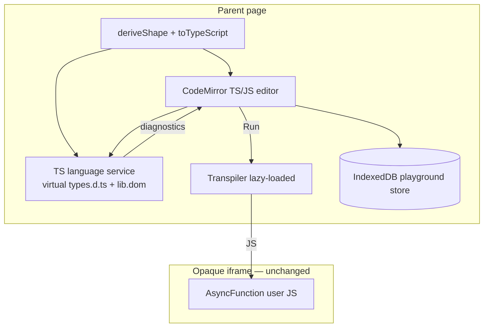

[Wiki Home](../../README.md) › [Future Features](../README.md) › [Plans](./README.md)

# TypeScript Playground — Implementation Plan

Plan for the [TypeScript Playground proposal](../typescript-playground.md). Resolved choices are in the [decision log](./typescript-playground-decisions.md); D8 (transpiler) and D9 (injection cue details) remain open.

**Prerequisite:** [Response Shape Viewer](../response-shape-viewer.md) / Explore should expose `deriveShape()` + `toTypeScript()` for the active endpoint — already underway in the client. This feature consumes that output; it does not duplicate derivation.

## User stories

1. **TypeScript by default.** As a learner on an API details page, I open the Playground in TypeScript and can write typed fetch code without configuring anything.
2. **Honest field feedback.** As a beginner, when I type `data.nmae` the editor shows a squiggle before I Run — because endpoint types were injected from the shape I just explored.
3. **Edit the types.** As a learner who wants to refine an interface, I can edit the generated types block; my edits aren't silently wiped when I switch endpoints unless I choose Reset types.
4. **JS escape hatch.** As a learner who isn't ready for types, I switch to JavaScript and get a separate saved buffer with JS starters.
5. **Run still works for experiments.** As a learner exploring a type error, I can still Run (unless transpilation itself fails) and compare checker feedback with console/Network output.
6. **Query → code bridge.** As a learner using Query Builder, Send to Playground loads types + a typed fetch snippet and **visibly** signals that the editor updated.
7. **Same playground everywhere.** As a maintainer, I implement TS once in `Playground.tsx`; API Details and Learn both inherit it.
8. **Persistence survives refresh.** As a returning learner, my TS code, JS code, edited types, and lesson progress survive refresh via IndexedDB.

## Architecture



### Persistence record (IndexedDB)

One record per logical key (endpoint URL or challenge `storageKey`), scoped by language mode where needed:

```ts
interface PlaygroundRecord {
  lang: "ts" | "js";
  userCode: string;
  types: string; // TS only; empty in JS mode records
  typesSource: "generated" | "edited";
  updatedAt: number;
}
```

Migration: on first load, read legacy `localStorage` keys (`sampleapis:playground:*`, `sampleapis:challenges:code:*`) and write equivalent records; keep localStorage keys until migration confirmed (or delete after successful write).

Lesson progress (`sampleapis:challenges:*`) moves to the same store or a sibling object store — same module, two stores.

### Editor

- `@codemirror/lang-javascript` with `{ typescript: true }` for TS mode; plain `javascript()` for JS mode.
- TS language service: virtual file(s) for injected types + standard libs. Implementation options: `@typescript/vfs` + worker, or codemirror-copilot-style TS integration — pick during phase 2 spike.
- Reconfigure extensions when toggling TS/JS or when types regenerate.

### Run pipeline

1. Read buffer; if TS, concatenate types + user code (or use virtual files for check vs run consistently).
2. Transpile (D8 — default `esbuild-wasm`, lazy import on first Run).
3. On transpile error → show in Output, disable Run until fixed.
4. On success → post JS to sandbox via existing tokened channel; Network/console unchanged.

### Types block UX

- Visible region at top of TS buffer, delimited by comments (e.g. `// --- endpoint types (editable) ---`) so save/split logic can find it.
- Initial load / endpoint change: if `typesSource === "generated"`, replace types region from `toTypeScript(shape, endpoint)`.
- Snippet tabs and Send to Playground respect active mode and replace appropriate regions.

### Injection feedback (D9)

Minimum bar: user must notice the editor changed without reading the buffer diff. Implement at least two of: scroll-into-view, 2–3s banner, editor border pulse. Host passes injection via existing `injectedCode` prop; Playground owns the feedback UI.

## Build phases

| Phase | Scope | Done when |
| ----- | ----- | --------- |
| 1. IndexedDB module | Store, CRUD, migration from localStorage, used by Playground save/load | Existing playground + challenge code survives refresh after migration; tests for round-trip |
| 2. TS/JS mode toggle | Separate buffers, TS-default, mode switch UI, TS + JS snippets | Toggle loads correct buffer; both modes persist |
| 3. Transpile-on-run | Lazy transpiler, error display, Run gating per D7 | Valid TS runs; syntax error blocks with clear message; sandbox unchanged |
| 4. Language service + types inject | Wire shape → types block; live diagnostics; `typesSource` logic on endpoint switch | Squiggle on typo'd field name; edited types preserved across endpoint change |
| 5. Send to Playground + injection UX | Types + snippet injection; visual cue per D9 | Query Builder send is obvious; typed snippet compiles |
| 6. Learn content (optional follow-up) | TS starters for `rest-basics` challenges | Challenges work in TS default without confusing blank types |

## Testing & verification

- Unit tests: persistence serialize/deserialize, types-region split/merge, migration from fixture localStorage keys.
- Unit tests: transpile wrapper (valid TS, syntax error messages).
- Manual: TS default → edit types → switch endpoint → confirm generated vs edited behavior.
- Manual: Send to Playground from Query Builder — visual cue and typed run.
- Manual: Learn track — Run still passes checks with TS starter (runtime grading unchanged).
- Bundle: confirm transpiler + language service load lazily; measure first-Run cost.

## Out of scope (v1)

- Shareable playground links — **rejected**; not pursuing.
- JSON Schema / Zod emitters in the editor (Shape Viewer copy button is enough).
- Full IDE features (rename symbol, go-to-definition across files, multi-file projects).
- Server-side TS execution.

## Key files to touch

- [Playground.tsx](../../../client/src/components/Playground/Playground.tsx) — mode toggle, editor extensions, run pipeline, injection feedback
- [sandboxBootstrap.ts](../../../client/src/components/Playground/sandboxBootstrap.ts) — no change expected
- [snippets.ts](../../../client/src/components/Playground/snippets.ts) — TS variants
- [types.ts](../../../client/src/components/Playground/types.ts) — `InjectedCode` may gain `lang` / `includeTypes`
- New: `client/src/storage/playgroundStore.ts` (or similar)
- [APIDetails.tsx](../../../client/src/pages/APIDetails/APIDetails.tsx) — Send to Playground payload
- [progress.ts](../../../client/src/challenges/progress.ts) — migrate to IndexedDB

## Related

- [Decision log](./typescript-playground-decisions.md)
- [Response Shape Viewer implementation](./response-shape-viewer-implementation.md) — shared `deriveShape()` / `toTypeScript()`
- [Query Builder implementation](./query-builder-implementation.md) — Send to Playground bridge
