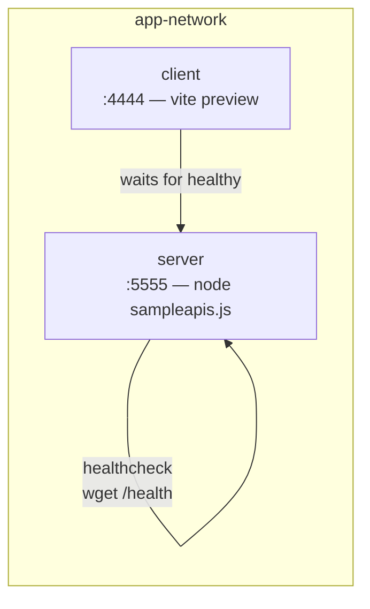

[Wiki Home](../README.md) › [Operations](./README.md)

# Docker

`docker compose up` runs the full stack. Both images build from **`node:26-alpine`**.

## Services

- **server** — installs production deps only (`npm ci --omit=dev`) and runs as the unprivileged `node` user. The image sets `NODE_ENV=production`, but compose **overrides it to `development`** — the compose stack is dev-oriented (see the bind mounts below), so the server logs with morgan `dev` here. Compose adds a healthcheck against [`/health`](../api/service-routes.md) every 10s.
- **client** — builds the app (`tsc && vite build`) and serves the production bundle with `vite preview`. Compose starts it only after the server reports healthy.

## Dev-friendly wiring

Compose bind-mounts `./server` and `./client` into the containers (with anonymous volumes shielding each `node_modules`), so local edits are visible inside the containers without rebuilding the images.

## Key files

- [docker-compose.yml](../../docker-compose.yml)
- [server/Dockerfile](../../server/Dockerfile)
- [client/Dockerfile](../../client/Dockerfile)

## Related

- [Local Development](./local-development.md)
- [Deployment](./deployment.md)
